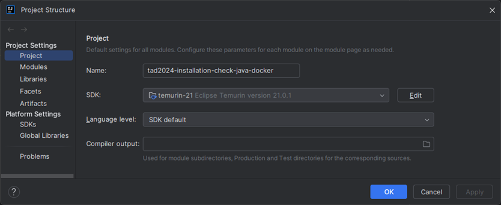

# TAD2024 - Installation check Java & Docker

* Clone or download this repository
* Open this repo with IntelliJ IDEA!
* You might have to correct the used JDK version in the project structure (menu File / Project Structure...):
  * Project -> SDK
  * 
  * Modules -> Language level
  * 
  
* Please make sure you reload the maven POM file in IntelliJ IDEA:
  *  
* Or set the maven auto reload settings to 'Any changes'.
  * 
* Open a terminal window in IntelliJ IDEA and type the following command:
```shell
./mvnw clean verify
```
* The output in the terminal should show something like this (all tests passed):

* Because the tests are running in a Docker container, it is also verified that Docker is working